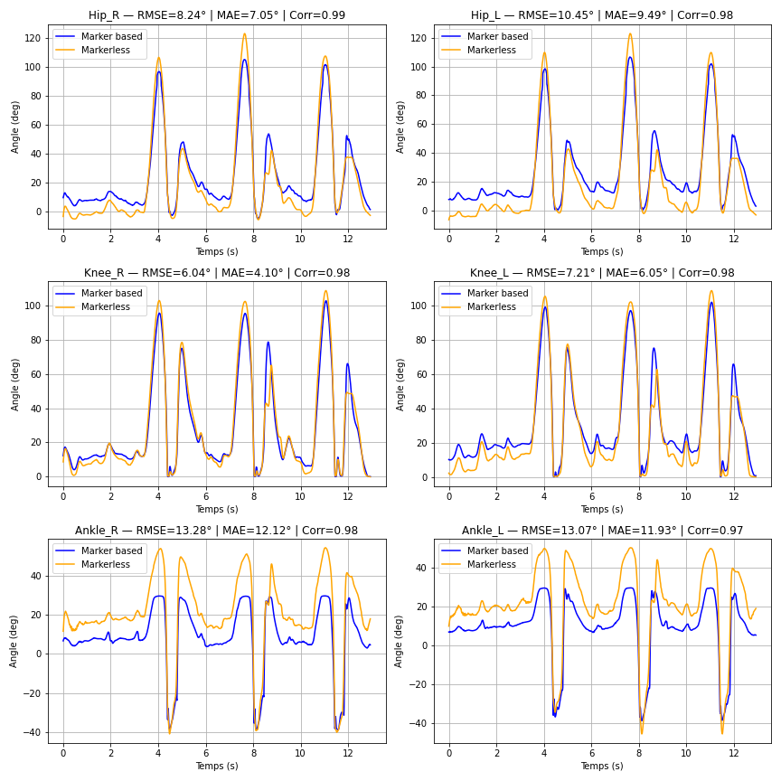

# MAM2ADMM-Series00-Git-carlamolinie-carlamolinie
Ce dépôt va me servir à apprendre les bases de Git et GitHub.

J'ai déjà était initié une première fois à GitHub dans le cadre d'un projet. C'est donc pour ma part une deuxième approche de cet outil.

## Déposer une image

## Motivation pour apprendre Python, R et Git

J’ai déjà eu l’occasion d’utiliser ces outils lors d’un projet l’année dernière.  
Ce cours et ce devoir sont pour moi une opportunité de répéter les bases et de les solidifier.  
Je suis motivée à approfondir mes compétences, car je sais qu’elles me seront utiles dans la suite de mes études.  
Cette initiation va me permettre de me servir de cet outil dans de futurs projets collaboratifs.

## Image locale

